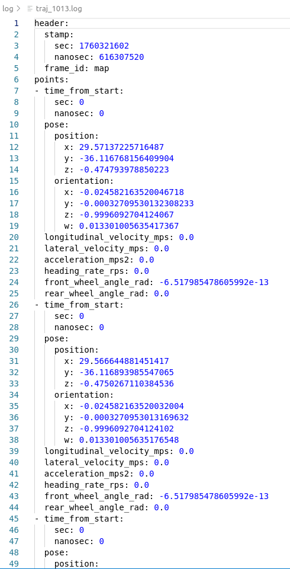
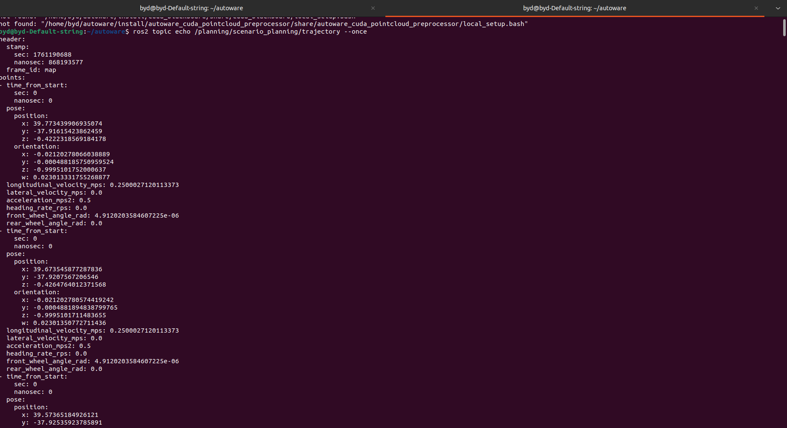
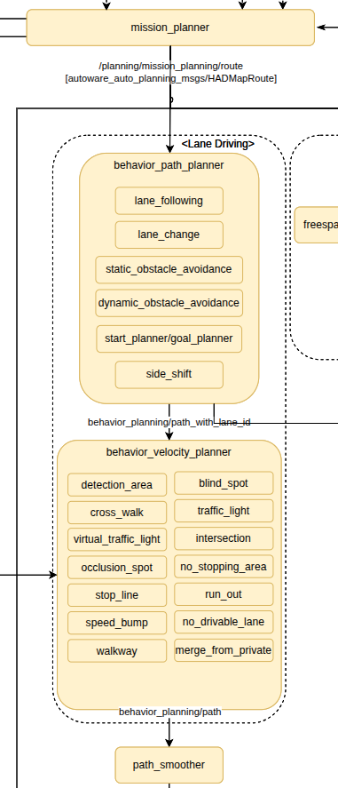
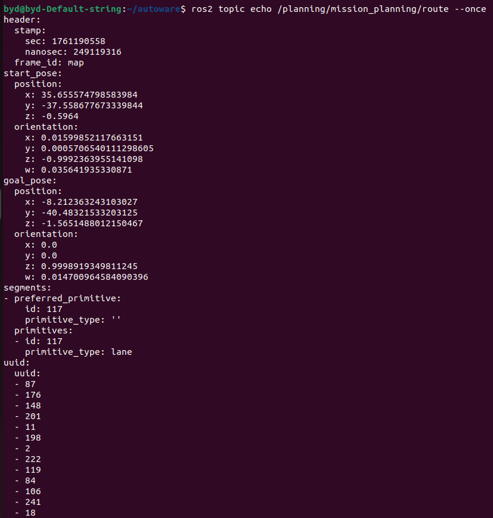
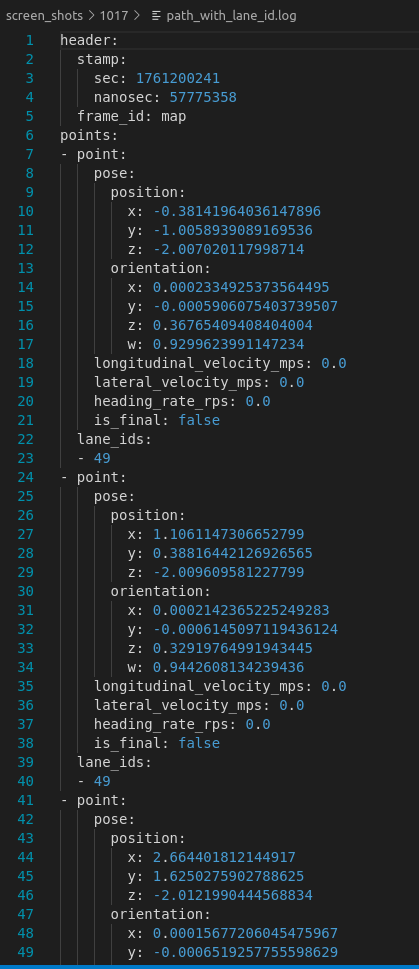
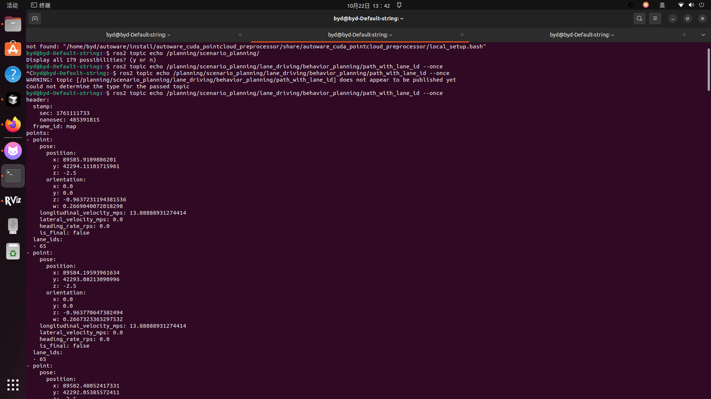
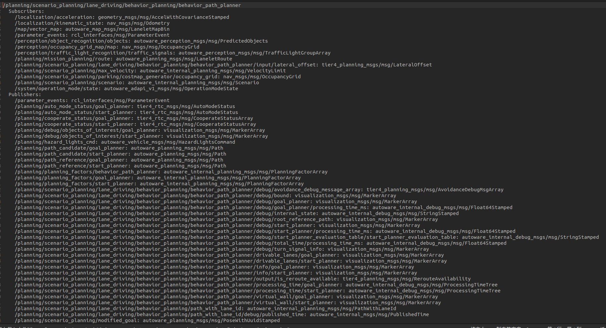
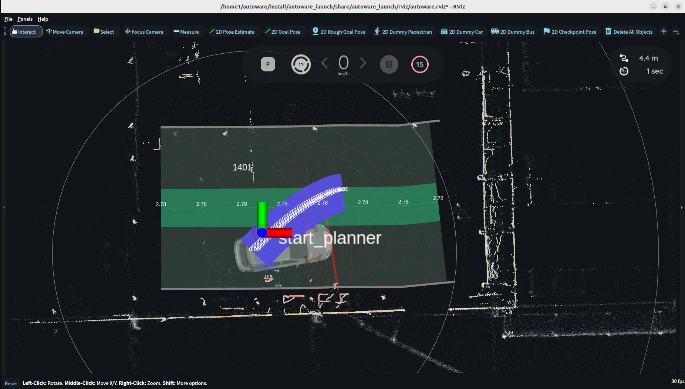
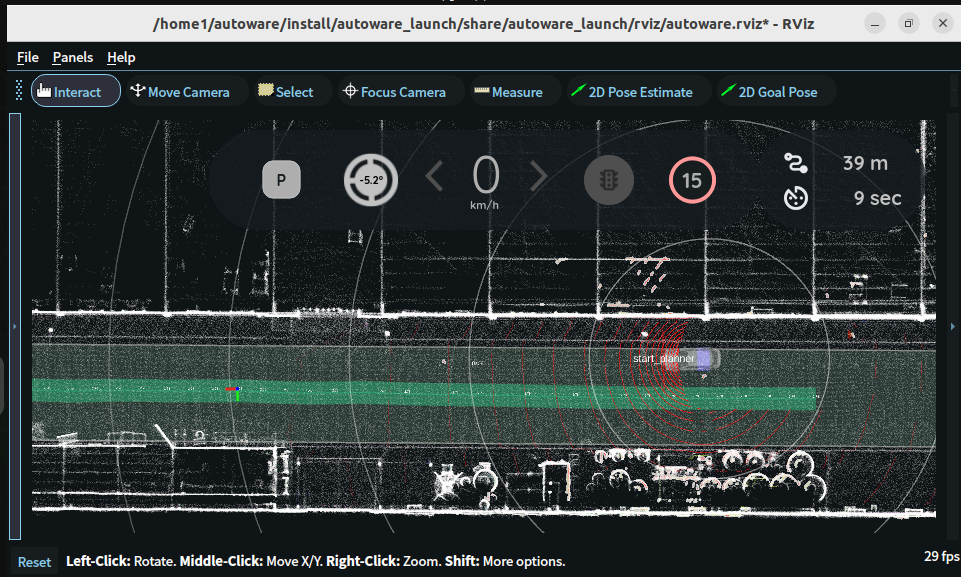
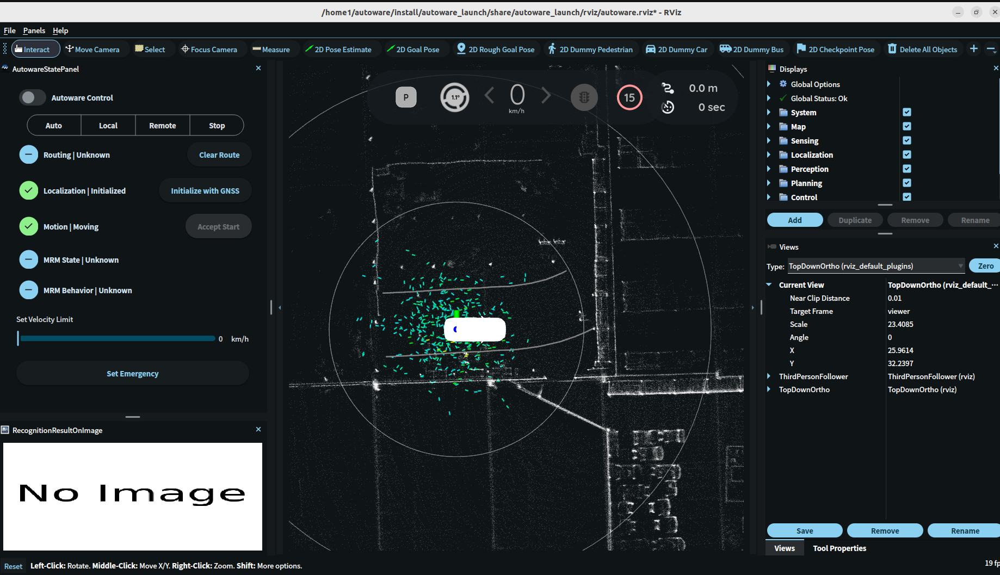

<!--
 * @Autor: wei.canming
 * @Version: 1.0
 * @Date: 2025-10-14 10:28:32
 * @LastEditors: wei.canming
 * @LastEditTime: 2025-10-23 20:55:22
 * @Description: 
-->
# <title>调试过程及结果记录</title>

## 问题描述

- `planning`模块的最终输出话题 /planning/scenario_planning/trajectory [Trajectory] 中的 longitudinal_velocity_mps 数据为0



- 仿真环境下，使用 planning_simulator.launch.xml 启动文件，地图文件相同，对应话题输出中 longitudinal_velocity_mps 不为0，且随着车辆运动，一直在变化


- 发布该话题的节点以及planning模块内部的数据传输方向如下图

 

## 排查过程
### 1. 可能是planning模块中间子节点计算trajectory存在问题

- 首先排查 mission_planner 节点的输出，查看其输出，发现其传递到下一个节点 behavior_path_planner 的 topic 为 /planning/mission_planning/route [autoware_planning_msgs/msg/Route] 该话题不包含速度信息，只有起始点和终点的位姿信息和中间的lanelet数据。
 


- `behavior_path_planner` 节点输出的话题 `/planning/scenario_planning/lane_driving/behavior_planning/path_with_lane_id` 中，路径点的 `longitudinal_velocity_mps` 值为0。
 


仿真环境下，使用 planning_simulator.launch.xml 启动文件，地图文件相同，对应话题输出中 longitudinal_velocity_mps 为 lanelet地图中的speed_limit参数值
 


**问题**： `behavior_path_planner` 节点为什么没有把 lanelet地图中的speed_limit参数值传递给 longitudinal_velocity_mps？ 导致该节点最终输出的话题 path_with_lane_id 中 longitudinal_velocity_mps 值为0

#### 排查behavior_path_planner节点的输出

1. 该节点的输入和输出信息如下：
 


2. behavior_path_planner 内部 longitudinal_velocity_mps 的获取方式

**关键代码：**
```cpp
BehaviorModuleOutput PlannerManager::run(const std::shared_ptr<PlannerData> & data)
{
  // 1. 生成参考路径（从地图读取速度限制）
  SlotOutput result_output = SlotOutput{
    getReferencePath(data),  // 这里读取地图的speed_limit
    false, false, false
  };
  
  // 2. 按顺序运行每个Slot
  for (auto & planner_manager_slot : planner_manager_slots_) {
    // 根据上游状态选择不同的传播模式
    if (result_output.is_upstream_failed_approved) {
      planner_manager_slot.propagateWithFailedApproved();
    } else if (result_output.is_upstream_waiting_approved) {
      result_output = planner_manager_slot.propagateWithWaitingApproved(data, result_output);
    } else if (result_output.is_upstream_candidate_exclusive) {
      result_output = planner_manager_slot.propagateWithExclusiveCandidate(data, result_output);
    } else {
      result_output = planner_manager_slot.propagateFull(data, result_output);
    }
  }
  
  return result_output.valid_output;  // 最终输出
}
```

#### 排查源代码内部逻辑问题

1. 查看何时获取到速度信息

behavior_path_planner 内部 longitudinal_velocity_mps 的获取方式中，第一步得到的参考路径中，速度正常，确实为lanelet地图中的speed_limit参数值
 


2. 哪些情况下可能会将 longitudinal_velocity_mps 值设为0

behavior_path_planner 节点内部的组件

**完整配置结构：**

```yaml
# scene_module_manager.param.yaml
slots:
  - slot1
  - slot2
  - slot3
  - slot4

slot1:
  - "start_planner"

slot2:
  - "side_shift"
  - "avoidance_by_lane_change"
  - "static_obstacle_avoidance"
  - "lane_change_left"
  - "lane_change_right"
  - "external_request_lane_change_left"
  - "external_request_lane_change_right"

slot3:
  - "goal_planner"

slot4:
  - "dynamic_obstacle_avoidance"
```

### Slot处理流程

```
Input: Reference Path (from lanelet centerline)
  ↓
┌─────────────────────────────────────────────┐
│ Slot 1: Start Planner                       │
│ - 检查是否需要启动规划                       │
│ - 如果车辆静止且需要启动，生成启动路径         │
│ - 否则，直接传递输入路径                     │
└─────────────────────────────────────────────┘
  ↓
┌─────────────────────────────────────────────┐
│ Slot 2: 避障和换道模块                       │
│ - 静态避障 (Static Obstacle Avoidance)       │
│ - 换道 (Lane Change Left/Right)             │
│ - 侧移 (Side Shift)                         │
│ - 通过换道避障 (Avoidance by Lane Change)   │
│                                             │
│ 工作方式：                                   │
│ 1. 所有模块检查是否需要执行                   │
│ 2. 需要执行的模块作为candidate并行运行        │
│ 3. 批准后的模块串行修改路径                   │
└─────────────────────────────────────────────┘
  ↓
┌─────────────────────────────────────────────┐
│ Slot 3: Goal Planner                        │
│ - 检查是否接近目标点                         │
│ - 生成停车路径                               │
│ - 设置目标点附近的速度（通常为0）             │
└─────────────────────────────────────────────┘
  ↓
┌─────────────────────────────────────────────┐
│ Slot 4: Dynamic Obstacle Avoidance          │
│ - 动态避障（实验性功能，默认false）           │
└─────────────────────────────────────────────┘
  ↓
Output: Final Path with Lane ID
  → /planning/behavior_planning/path_with_lane_id
```

#### 问题描述：可能是某些场景模块修改了速度

可能会修改路径速度的场景模块（Scene Modules）包括：

- Goal Planner
- Start Planner  
- Avoidance Module
- Lane Change Module

#### 可能清零速度的场景
1. **停车场景**：车辆准备停车时
2. **避障场景**：检测到障碍物需要停车
3. **交通灯**：红灯停车
4. **人行横道**：有行人通过

#### goal_planner组件可能将速度设置为0
当车辆接近目标点时，`createGoalAroundPath` 函数会被调用，将路径速度设置为0。

#### 相关代码
**位置：** `src/universe/autoware_universe/planning/behavior_path_planner/autoware_behavior_path_planner_common/src/utils/path_utils.cpp` (行547-550)

```cpp
BehaviorModuleOutput createGoalAroundPath(const std::shared_ptr<const PlannerData> & planner_data)
{
  // ... 生成goal周围的路径 ...
  
  // Insert zero velocity to each point in the path.
  for (auto & point : reference_path.points) {
    point.point.longitudinal_velocity_mps = 0.0;  // 强制设为0
  }
  
  // ...
}
```
#### 排查方法

- 可能室内环境下，设定的目标点距离起始点太近，选择在室外环境进行测试。结果依然无法获取到速度信息。

 


#### 排查方法

关闭behavior_path_planner节点内部的组件

`default_preset.yaml`   只保留 start planner 和 goal planner模块
`scene_module_manager.param.yaml`   修改 start planner 和 goal planner模块的参数

### 2. 可能是感知模块的输出数据存在问题

- 关闭整个感知模块，在launch文件中设置launch_perception 参数为false； 
- 可以输出 `/planning/mission_planning/route` 话题，但是节点没有发布 `/planning/scenario_planning/lane_driving/behavior_planning/path_with_lane_id` 话题

 


### 目前进展 ⭐⭐⭐

**behavior_path_planner节点**  
reference_path话题能够获取到speed_limit信息，说明地图没有问题，参考路径传递到 start planner这一步也没有问题，但是 start_planner组件的输出数据中，longitudinal_velocity_mps数据为0，可能是某些原因导致 start planner组件将longitudinal_velocity_mps数据设置为0。


于晓晰： src/core/autoware_core/planning 

何焕妃： 
1. src/universe/autoware_universe/planning/autoware_mission_planner_universe  
2. src/universe/autoware_universe/planning/autoware_obstacle_stop_planner
3. src/universe/autoware_universe/planning/behavior_path_planner/autoware_behavior_path_avoidance_by_lane_change_module
4. src/universe/autoware_universe/planning/behavior_path_planner/autoware_behavior_path_static_obstacle_avoidance_module
5. src/universe/autoware_universe/planning/behavior_path_planner/autoware_behavior_path_external_request_lane_change_module

何京伟：
1. src/universe/autoware_universe/planning/behavior_path_planner/autoware_behavior_path_goal_planner_module
2. src/universe/autoware_universe/planning/behavior_path_planner/autoware_behavior_path_lane_change_module
3. src/universe/autoware_universe/planning/behavior_path_planner/autoware_behavior_path_side_shift_module
4. src/universe/autoware_universe/planning/behavior_path_planner/autoware_behavior_path_planner_common
5. src/universe/autoware_universe/planning/behavior_path_planner/autoware_behavior_path_start_planner_module

魏灿名：
1. src/universe/autoware_universe/planning/behavior_path_planner/autoware_behavior_path_planner
2. src/universe/autoware_universe/planning/behavior_path_planner/autoware_behavior_path_sampling_planner_module
3. src/universe/autoware_universe/planning/behavior_path_planner/autoware_behavior_path_dynamic_obstacle_avoidance_module
4. 整个模块的理解和调试